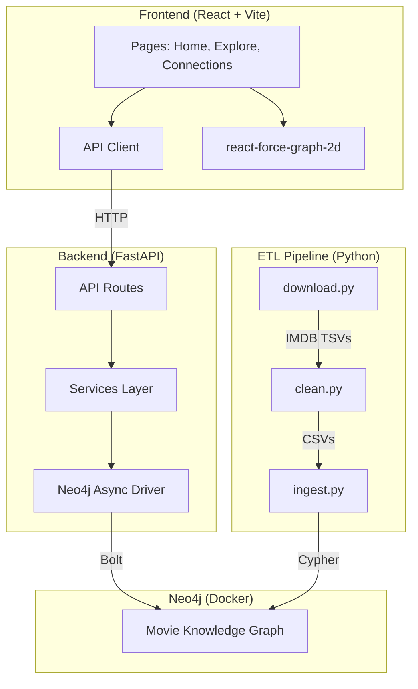

# 🎬 Personal Movie Knowledge Graph (PMKG)

A knowledge graph built from IMDB data to explore movie/actor/director relationships, find shortest paths between actors ("Six Degrees of Kevin Bacon"), and generate movie recommendations.

## Tech Stack

| Layer | Technology |
|---|---|
| Database | Neo4j 5.x (Docker) |
| ETL | Python 3.12 + Pandas |
| Backend | FastAPI |
| Frontend | React + Vite + TypeScript |
| Graph Viz | react-force-graph-2d |

## Quick Start

### Prerequisites
- Docker & Docker Compose
- Python 3.12+
- Node.js 20+

### 1. Start Infrastructure

```bash
cp .env.example .env
docker compose up -d
```

This starts:
- **Neo4j** — Browser at [http://localhost:7474](http://localhost:7474), Bolt at `bolt://localhost:7687`
- **Backend** — FastAPI at [http://localhost:8000](http://localhost:8000) (docs at `/docs`)

### 2. Run ETL Pipeline

```bash
cd backend
python -m venv .venv && source .venv/bin/activate
pip install -r requirements.txt
python -m etl.run_pipeline
```

### 3. Start Frontend

```bash
cd frontend
npm install
npm run dev
```

Frontend runs at [http://localhost:5173](http://localhost:5173).

## Project Structure

```
├── docker-compose.yml
├── backend/
│   ├── app/          # FastAPI application
│   └── etl/          # Data pipeline scripts
├── frontend/         # React + Vite app
└── data/             # Raw + cleaned IMDB data (.gitignored)
```

## Graph Data Model

```
(:Person {id, name, birthYear})
  -[:ACTED_IN {role}]->(:Movie {id, title, releaseYear, rating})
  -[:IN_GENRE]->(:Genre {name})

(:Person)-[:DIRECTED]->(:Movie)
```
### Architecture Diagram


