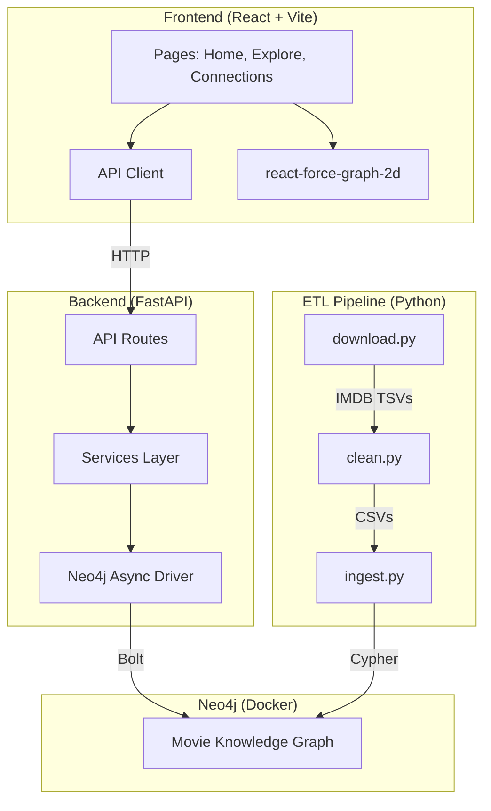

# PMKG — Phase 1 Walkthrough

## What was done

Scaffolded the complete project from scratch based on the PRD. The project is now a fully structured monorepo ready for Phase 2 (ETL + data loading).

### Tech Stack (Finalized)

| Layer | Technology | Rationale |
|---|---|---|
| Database | Neo4j 5.x via Docker | Reproducible, no idle auto-deletion |
| ETL | Python 3.12 + Pandas | Best for IMDB TSV processing |
| Backend | FastAPI (async) | Auto docs, same language as ETL |
| Frontend | React + Vite + TypeScript | Matches existing skills, rich graph viz |
| Graph Viz | react-force-graph-2d | Force-directed, performant for 10k+ nodes |
| Dev Env | Docker Compose | One command for infra |

---

### Files Created (55 files)

#### Root
- [.gitignore](file:///Users/khantsithu/code/movie-knowledge-graph/.gitignore) — Python, Node, data, Neo4j volumes
- [.env.example](file:///Users/khantsithu/code/movie-knowledge-graph/.env.example) — Neo4j + backend config
- [README.md](file:///Users/khantsithu/code/movie-knowledge-graph/README.md) — Quick start guide
- [docker-compose.yml](file:///Users/khantsithu/code/movie-knowledge-graph/docker-compose.yml) — Neo4j + FastAPI services

#### Backend — FastAPI
- [main.py](file:///Users/khantsithu/code/movie-knowledge-graph/backend/app/main.py) — App entry with lifespan-managed Neo4j driver + CORS
- [config.py](file:///Users/khantsithu/code/movie-knowledge-graph/backend/app/core/config.py) — pydantic-settings from env vars
- [neo4j.py](file:///Users/khantsithu/code/movie-knowledge-graph/backend/app/db/neo4j.py) — Async driver init + FastAPI DI
- **Schemas:** [movie.py](file:///Users/khantsithu/code/movie-knowledge-graph/backend/app/schemas/movie.py), [person.py](file:///Users/khantsithu/code/movie-knowledge-graph/backend/app/schemas/person.py), [graph.py](file:///Users/khantsithu/code/movie-knowledge-graph/backend/app/schemas/graph.py)
- **Services:** [movie_service.py](file:///Users/khantsithu/code/movie-knowledge-graph/backend/app/services/movie_service.py), [person_service.py](file:///Users/khantsithu/code/movie-knowledge-graph/backend/app/services/person_service.py), [path_service.py](file:///Users/khantsithu/code/movie-knowledge-graph/backend/app/services/path_service.py), [recommendation_service.py](file:///Users/khantsithu/code/movie-knowledge-graph/backend/app/services/recommendation_service.py)
- **API Routes:** [movies.py](file:///Users/khantsithu/code/movie-knowledge-graph/backend/app/api/movies.py), [persons.py](file:///Users/khantsithu/code/movie-knowledge-graph/backend/app/api/persons.py), [paths.py](file:///Users/khantsithu/code/movie-knowledge-graph/backend/app/api/paths.py), [recommendations.py](file:///Users/khantsithu/code/movie-knowledge-graph/backend/app/api/recommendations.py)

#### Backend — ETL Pipeline
- [download.py](file:///Users/khantsithu/code/movie-knowledge-graph/backend/etl/download.py) — Fetch IMDB TSVs with progress
- [clean.py](file:///Users/khantsithu/code/movie-knowledge-graph/backend/etl/clean.py) — Filter to top 10k movies, extract persons/genres
- [ingest.py](file:///Users/khantsithu/code/movie-knowledge-graph/backend/etl/ingest.py) — Batch load into Neo4j with constraints
- [run_pipeline.py](file:///Users/khantsithu/code/movie-knowledge-graph/backend/etl/run_pipeline.py) — Orchestrate full ETL

#### Frontend — React + Vite
- [App.tsx](file:///Users/khantsithu/code/movie-knowledge-graph/frontend/src/App.tsx) — Router + React Query provider + nav
- [client.ts](file:///Users/khantsithu/code/movie-knowledge-graph/frontend/src/api/client.ts) — API client with typed interfaces
- [HomePage.tsx](file:///Users/khantsithu/code/movie-knowledge-graph/frontend/src/pages/HomePage.tsx) — Hero with nav cards
- [ExplorePage.tsx](file:///Users/khantsithu/code/movie-knowledge-graph/frontend/src/pages/ExplorePage.tsx) — Movie/person search + results grid
- [ConnectionFinder.tsx](file:///Users/khantsithu/code/movie-knowledge-graph/frontend/src/pages/ConnectionFinder.tsx) — Six Degrees UI with autocomplete
- [index.css](file:///Users/khantsithu/code/movie-knowledge-graph/frontend/src/styles/index.css) — Dark theme design system

---

### Validation Results

| Check | Result |
|---|---|
| TypeScript compilation (`tsc --noEmit`) | ✅ Zero errors |
| Frontend dev server (`npm run dev`) | ✅ Starts on `:5173` |
| Git commit | ✅ 55 files, initial commit |

---

### Architecture Diagram

---

### Next Steps — Phase 2

1. **`docker compose up`** to start Neo4j + backend
2. **Run ETL:** `python -m etl.run_pipeline` (downloads ~1GB of IMDB data, filters to top 10k movies, loads into Neo4j)
3. **Test APIs** at `http://localhost:8000/docs`
4. **Connect frontend** to live backend and verify search + graph visualization
